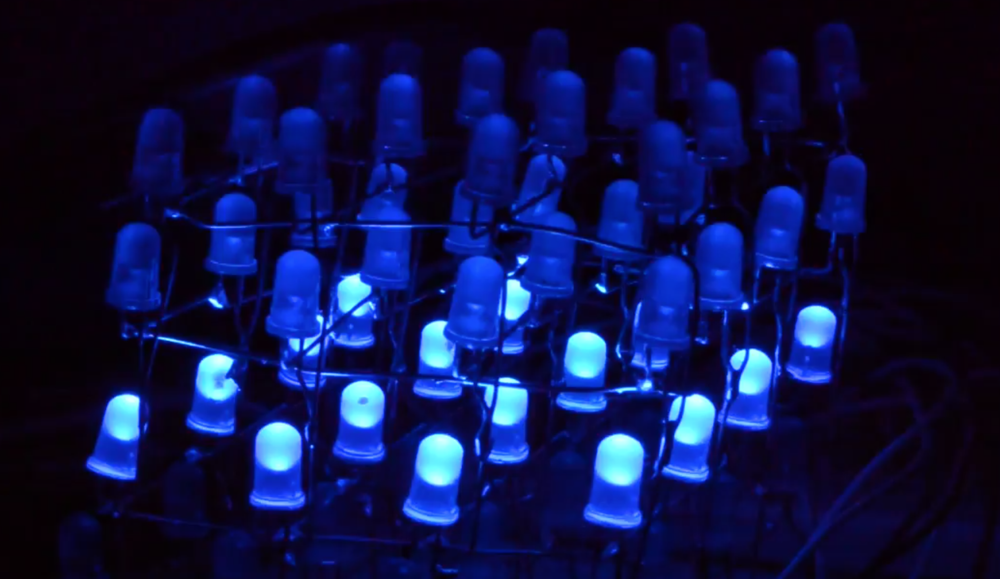

# BFCY
*Electronics Technology*

# Project 1: Guitar Amplifier

)

* Designed circuit board using KiCAD

# Project 2: 4x4x4 LED Cube

* ATMega328P
* Language: C
* Designed circuit board using KiCAD
